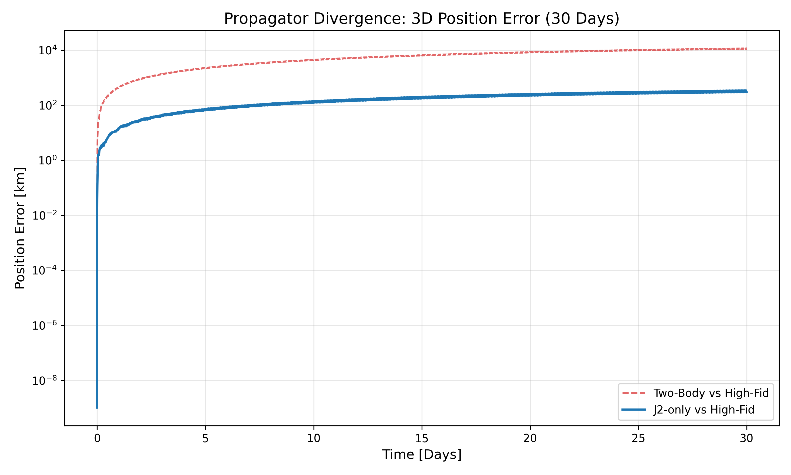
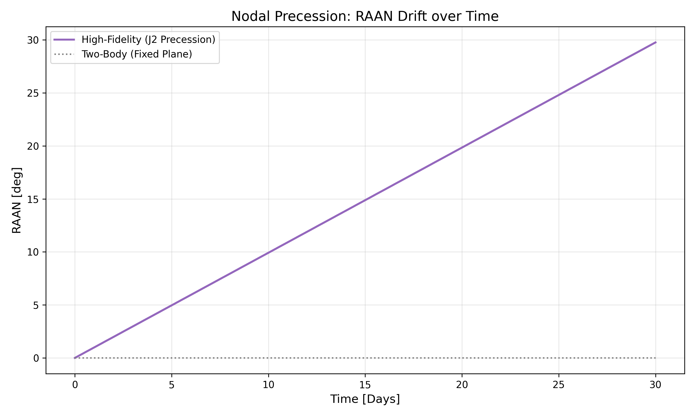
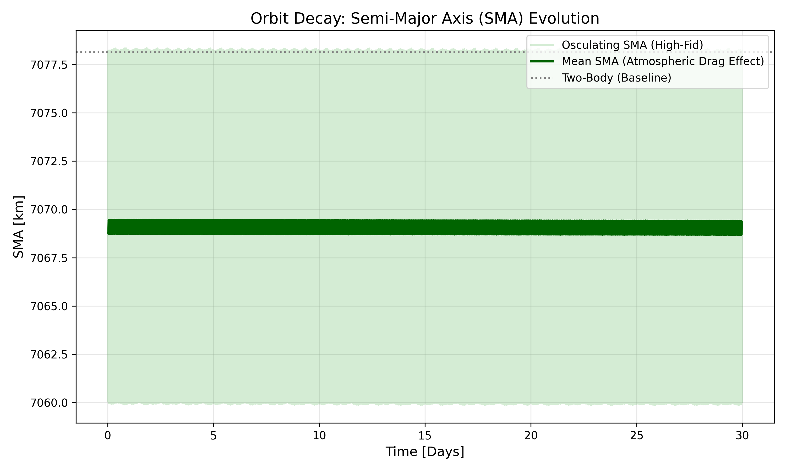
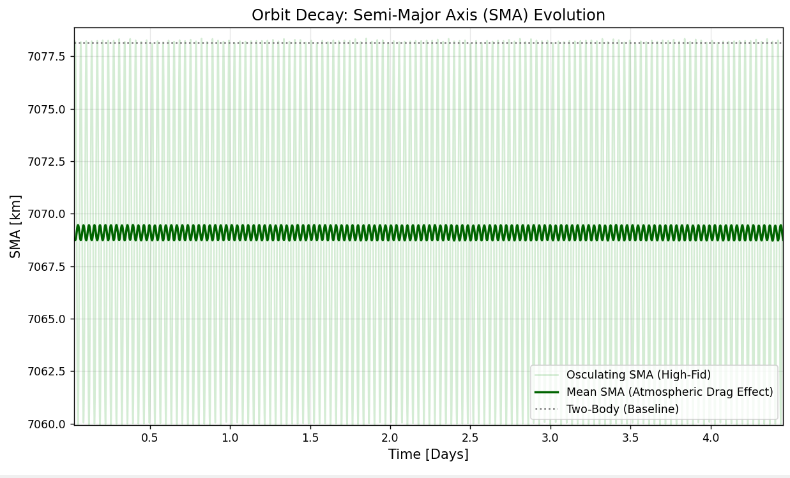
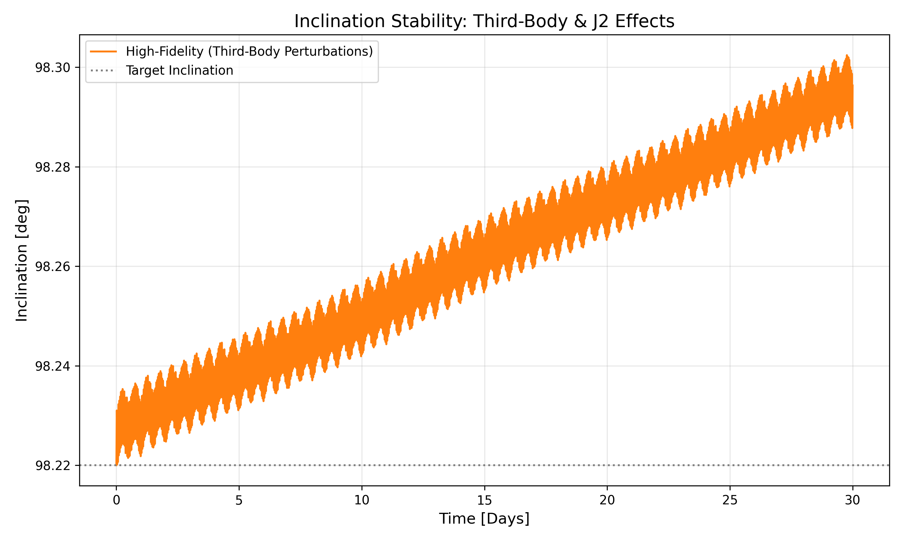
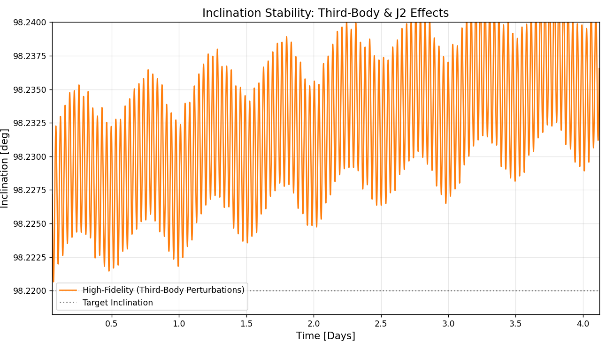

# High-Fidelity Orbit Propagation and Perturbation Analysis

## Project Overview
This project presents a comparative study of orbital propagation models for a Low Earth Orbit (LEO) satellite. Using **GMAT (General Mission Analysis Tool)** for high-fidelity numerical integration and **Python** for data processing, I analyzed how different perturbation forces affect orbital stability and prediction accuracy over a 30-day mission duration.

The project demonstrates the critical divergence between idealized mathematical models and real-world space environments, specifically focusing on $J_2$ effects, atmospheric drag, and third-body gravitational perturbations.

## Mission Scenario
*   **Spacecraft:** 6U/12U CubeSat (Mass: 20 kg, Drag Area: 0.1 m²)
*   **Orbit Type:** Sun-Synchronous Orbit (SSO)
*   **Initial State (Keplerian):**
    *   Semi-Major Axis (SMA): 7078.14 km (~700 km altitude)
    *   Inclination: 98.22°
    *   Eccentricity: 0.001
    *   RAAN: 0.0°
*   **Epoch:** 01 Jan 2024 12:00:00.000 UTC

## Force Models Comparison
I implemented and compared three distinct models to evaluate the impact of each perturbation:
1.  **Two-Body Model:** Idealized Keplerian motion (Earth as a point mass).
2.  **J2-only Model:** Inclusion of the Earth's oblateness ($J_2$ harmonic).
3.  **High-Fidelity Model:** 
    *   EGM96 Gravity Field (20x20 degree/order).
    *   Atmospheric Drag (Exponential model).
    *   Solar Radiation Pressure (SRP).
    *   Third-Body Gravity (Sun and Moon/Luna).

---

## Technical Analysis & Results

### 1. Propagator Divergence (3D Position Error)

This plot quantifies the Euclidean distance error between the High-Fidelity "truth" and simplified models.
*   **Accuracy:** After resolving state-reset synchronization, the error at $t=0$ is null ($<10^{-9}$ km).
*   **Two-Body vs High-Fid:** The error exceeds **10,000 km** within a week, proving that idealized models are unusable for operational tracking.
*   **J2-only vs High-Fid:** Includind $J_2$ reduces the error to ~300 km after 30 days, highlighting that Earth's non-spherical gravity is the dominant perturbation in LEO.

### 2. Nodal Precession (RAAN Drift)

To maintain Sun-Synchronicity, the orbital plane must rotate ~0.985°/day. The High-Fidelity model predicts a **30° drift over 30 days**, matching the SSO design requirement driven by $J_2$ torque.

### 3. Orbit Decay & Osculating Elements (SMA)

This analysis distinguishes between **Osculating** and **Mean** elements:
*   **Osculating SMA (Light Green):** Shows the rapid $\pm 8$ km fluctuations caused by the non-spherical gravity field during each orbit.
*   **Mean SMA (Dark Green):** By applying a rolling mean filter (95-minute window), the secular energy evolution is revealed. The offset from the Two-Body baseline (~8 km) represents the perturbed potential energy shift.

#### *Technical Zoom: J2-Induced Oscillations*

*Zooming into the first days reveals the high-frequency periodicity of SMA. These are not errors but real physical responses to the Earth's mass distribution.*

### 4. Inclination Stability & Third-Body Effects

The inclination drift (from 98.22° to ~98.30°) is primarily driven by the Sun and Moon.

#### *Technical Zoom: Lunar Perturbation Signature*

*The zoom showcases a "beating" pattern in the inclination. The long-period waves represent the signature of **Lunar gravitational torque**, which modulates the orbital plane orientation over the 28-day lunar cycle.*

---

## Technical Skills Demonstrated
*   **Mission Analysis:** Understanding of SSO geometry, secular vs. periodic perturbations, and mean/osculating element conversion.
*   **GMAT Mastery:** Professional use of GMAT for numerical propagation, force model setup, and mission sequence scripting (Fixed-step integration).
*   **Data Science (Python):** Advanced data processing using Pandas (moving averages), synchronization of large time-series datasets, and high-quality scientific visualization with Matplotlib.

## Project Structure
```text
├── gmat/      # GMAT .script files
├── scripts/   # Python analysis and plotting scripts
├── data/      # Synchronized CSV output files
├── results/   # Generated PNG plots and zooms
└── README.md
```
---

## Author
**Giuliano Pennacchio**  
*Aerospace Engineer (MSc) | Specialization in GNC & Flight Dynamics*

## Contact
[](mailto:giuliano.pennacchio12@gmail.com)
[](https://www.linkedin.com/in/giuliano-pennacchio-5385572b7/)
[](https://github.com/GiulianoPennacchioJ)

---
*Developed as part of my Flight Dynamics & State Estimation Portfolio.*